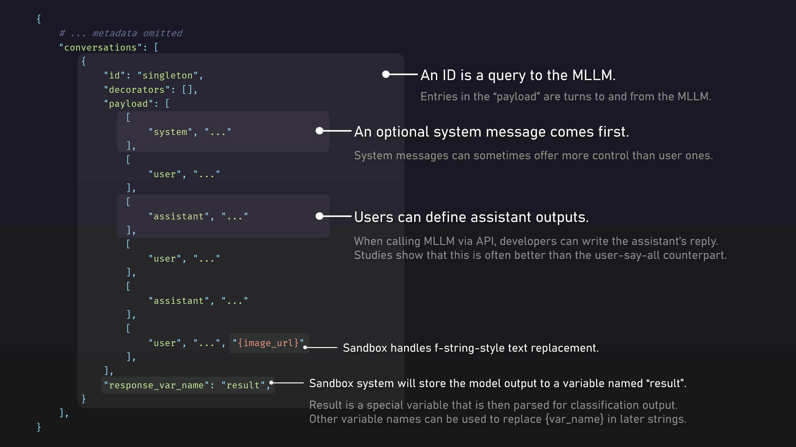

# MLLM Defake: A Scalable MLLM-based AIGC Detection Framework

This project implements a scalable Multi-modal Large Language Model (MLLM) based approach for detecting AI-generated images (AIGC). It provides a command-line interface through the `mllmdf` (shorthand for "MLLM Defake") CLI tool for analyzing and detecting fake images generated by AI.

## Quick Start

To install:

```bash
# Install the package
git clone git@github.com:Gennadiyev/mllm-defake.git
pip install -e ".[dev]"
```

To use:

```bash
# Run basic inference with GPT-4o-mini
export OPENAI_API_KEY='sk-...'
# 1. Classify a single image as real or fake (or unknown) using GPT-4o-mini. Prints the result to the console.
mllmdf classify demo/real/img118131.jpg --model gpt4omini
# 2. Evaluate on a dataset containing real and fake images. Produces a CSV file with results under ./outputs
mllmdf infer --model gpt4omini --real_dir demo/real --fake_dir demo/fake
# 3. Generate a markdown report from the CSV file. Checks all CSV files under ./outputs
mllmdf doc
```

Use `--help` to learn more about each command.

## Developing

The `mllmdf` entry point is at [`mllm_defake/cli.py`](mllm_defake/cli.py).

### 1. Where actual evaluation procedures happen: `MLLMClassifier`

> [!WARNING]  
> To support a new MLLM, you may wish to edit the [`mllm_defake/vllms.py`](mllm_defake/vllms.py) file, not the `MLLMClassifier` class. Modify the `cli.py` to include the new model.

The core of the package is the `MLLMClassifier` class in `mllm_defake/classifiers/mllm_classifier.py`. It provides:

- Prompt-based classification using various MLLMs
- Support for different model backends (GPT-4p-Vision, self-hosted Llama herd of models, etc.)
- Evaluation metrics and result documentation
- Decorator pattern for result post-processing

For external integrations, `MLLMClassifier.classify` can be used directly. It takes an image path (and label if desired) and returns a prediction.

### 2. Implementing new MLLMs by editing `vllms.py`

Currently, supported models include:
- GPT-4o (`gpt4o`)
- GPT-4o-Mini (`gpt4omini`)
- [Llama-3.2-11B-Vision-Instruct](https://huggingface.co/meta-llama/Llama-3.2-11B-Vision-Instruct) (`llama32vi`)
- [Llama-3.2V-11B-CoT](https://huggingface.co/Xkev/Llama-3.2V-11B-cot) (`llama32vcot`)
- [QVQ-72B-Preview](https://huggingface.co/Qwen/QVQ-72B-Preview) (`qvq`)

More models can be added by extending the base class to your needs.

> [!WARNING]  
> The repository does NOT download or infer with the open-source models automatically. Use [`vllm`](https://github.com/vllm-project/vllm) to serve your own API server, and pass the URL to `BASE_URL` as environment variable.

### 3. Proudly presenting our prompt system



After months of iterations, lots of overhauls and quite a few patches, the prompt system is now stable and ready for use. It allows for easy creation of prompts independent of MLLMs and datasets. It is possible to use decorators to interact with the prompt system and modify the prompts using Python during runtime.

Here is a template to get you started:

```json
{
    "format_version": "3",
    "name": "simple_detector",
    "conversations": [
        {
            "id": "main",
            "response_var_name": "result",
            "payload": [
                ["system", "You are analyzing an image..."],
                ["user", "Please analyze this image:", "{image_url}"],
                ["assistant", "Based on my analysis..."]
            ]
        }
    ]
}
```

If `"result"` is specified as the response variable, it will be returned, in string format, as the result of the classification. A post-processing function is then used to convert the string to an integer value, where 0 is fake, 1 is real, -1 is unknown.

For more complex prompts, please refer to the [`prompts`](prompts) directory.

While the logic of prompt system is implemented within the `MLLMClassifier` class, decorators You may define external decorators anywhere, `./decorators` will be automatically imported.

### 4. API Key Conventions

To mitigate the risk of exposing API keys, environment variables are used to store sensitive information. The env variable names are hard-coded in the [`mllm_defake/cli.py`](mllm_defake/cli.py) file, mainly in `load_model` function.

## License

This project is dual-licensed under the MIT and Apache 2.0 licenses. You may choose either license that best suits your needs.
